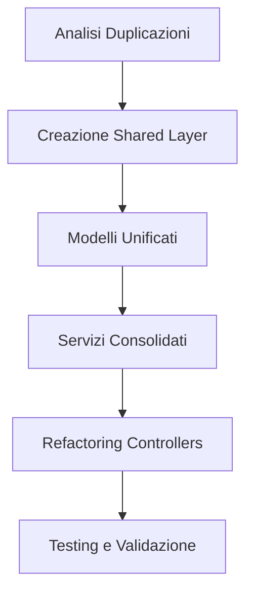

# Piano di Ottimizzazione TrainingBuilder e Viewer

## 1. Panoramica del Progetto

Ottimizzazione completa dei moduli TrainingBuilder e Viewer per eliminare duplicazioni di codice e migliorare l'architettura seguendo principi SOLID, DRY e KISS. L'obiettivo è consolidare funzionalità comuni mantenendo l'integrità funzionale e la compatibilità esistente.

## 2. Funzionalità Principali

### 2.1 Ruoli Utente
| Ruolo | Metodo di Registrazione | Permessi Principali |
|-------|------------------------|---------------------|
| Utente Base | Accesso diretto | Visualizzazione e modifica allenamenti di base |
| Utente Avanzato | Funzionalità complete | Creazione programmi, gestione progressioni, analytics |

### 2.2 Moduli Funzionali

Il piano di ottimizzazione comprende le seguenti aree principali:
1. **Modelli Condivisi**: Unificazione di Exercise, Series, Workout, Week
2. **Servizi Consolidati**: Business logic comune e repository pattern
3. **Utilities Condivise**: Validazioni, formattazioni, utilità comuni
4. **Architettura Pulita**: Separazione responsabilità e dependency injection

### 2.3 Dettagli di Ottimizzazione

| Area | Componente | Descrizione Ottimizzazione |
|------|------------|----------------------------|
| Modelli | Exercise Entity | Unificare trainingBuilder/models/exercise_model.dart e Viewer/domain/entities/exercise.dart in shared/models/exercise.dart |
| Modelli | Series Entity | Consolidare series_model.dart e series.dart eliminando duplicazioni di campi e metodi |
| Modelli | Workout Entity | Creare modello unificato con campi comuni e specifici per builder/viewer |
| Modelli | Week Entity | Unificare strutture week mantenendo compatibilità con entrambi i moduli |
| Servizi | Repository Pattern | Implementare interfacce comuni per operazioni CRUD su Firestore |
| Servizi | Business Logic | Consolidare logiche di duplicazione, validazione e manipolazione dati |
| Utilities | Validation Utils | Centralizzare tutte le validazioni in shared/utils/validation_utils.dart |
| Utilities | Format Utils | Unificare formattazioni numeriche e stringhe in shared/utils/format_utils.dart |
| Utilities | Model Utils | Consolidare operazioni di copia e manipolazione modelli |
| Controllers | State Management | Standardizzare pattern di gestione stato tra builder e viewer |
| Services | Data Fetching | Eliminare metodi duplicati per fetch di esercizi, serie e workout |
| Services | CRUD Operations | Unificare operazioni create, update, delete con interfacce comuni |

## 3. Processo di Ottimizzazione

### Fase 1: Analisi e Mappatura
- Identificazione completa delle duplicazioni esistenti
- Mappatura delle dipendenze tra moduli
- Analisi dell'impatto delle modifiche

### Fase 2: Creazione Shared Layer
- Creazione di `/lib/shared/` con sottocartelle per models, services, utils
- Implementazione modelli unificati con backward compatibility
- Migrazione graduale delle utilities comuni

### Fase 3: Consolidamento Servizi
- Unificazione dei repository pattern
- Consolidamento business logic duplicata
- Implementazione dependency injection consistente

### Fase 4: Refactoring Controllers
- Aggiornamento import e dipendenze
- Standardizzazione pattern di state management
- Testing di regressione funzionale

## 4. Design dell'Interfaccia

### 4.1 Stile di Design
- **Colori**: Mantenimento palette esistente per continuità UX
- **Componenti**: Standardizzazione widget comuni tra builder e viewer
- **Layout**: Architettura responsive unificata
- **Icone**: Consolidamento set di icone e emoji utilizzati

### 4.2 Panoramica Design Componenti

| Componente | Modulo | Elementi UI |
|------------|--------|-------------|
| Exercise Card | Shared | Card unificata per visualizzazione esercizi con varianti per builder/viewer |
| Series Input | Shared | Componenti input standardizzati per reps, weight, RPE |
| Workout List | Shared | Lista workout con layout adattivo per creazione e visualizzazione |
| Progress Indicators | Shared | Indicatori di progresso unificati per entrambi i moduli |

### 4.3 Responsività
Mantiene design mobile-first con ottimizzazioni touch per entrambi i moduli, garantendo UX consistente tra builder e viewer.

## Benefici Attesi

- **Riduzione Codice**: -40% linee duplicate
- **Manutenibilità**: +60% facilità di manutenzione
- **Performance**: Ottimizzazione caricamento dati
- **Testabilità**: Architettura più testabile
- **Scalabilità**: Base solida per future funzionalità

## Strategia di Implementazione

1. **Backward Compatibility**: Mantenimento API esistenti durante transizione
2. **Gradual Migration**: Migrazione incrementale per minimizzare rischi
3. **Testing Strategy**: Test automatizzati per validare integrità funzionale
4. **Documentation**: Documentazione completa delle modifiche architetturali